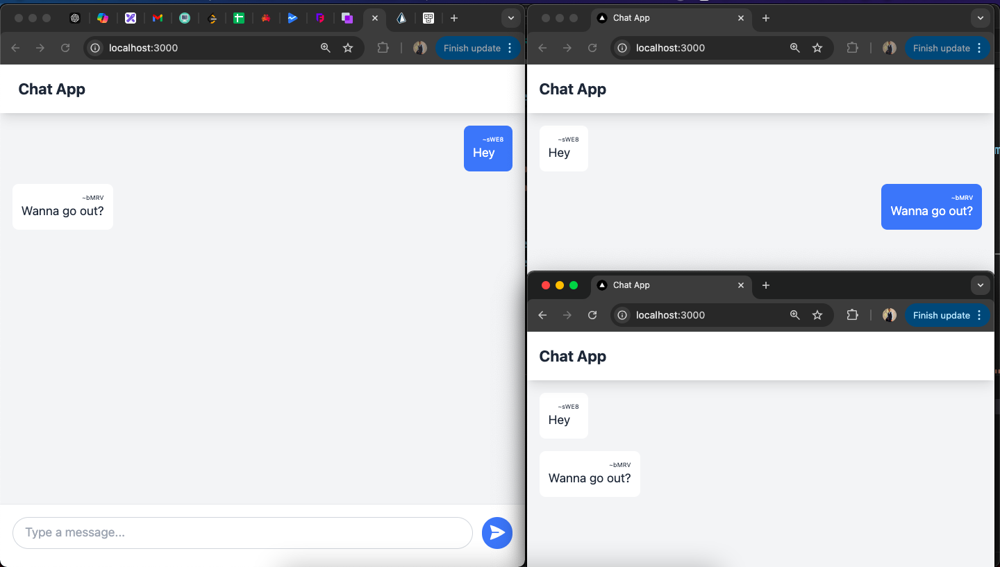

# Scalable Chat Application with Redis Pub/Sub

This project is a chat application built with scalability in mind. It utilizes Redis Pub/Sub to enable real-time communication across multiple backend server instances, ensuring a seamless user experience even during horizontal scaling.

## Why Redis Pub/Sub?

Traditional socket.io-based communication breaks down when scaling horizontally because users on different backend instances cannot message each other directly. Redis Pub/Sub acts as a central message broker, allowing all backend instances to subscribe to a channel and receive messages regardless of their own server location. Additionally, Redis's in-memory nature offers high performance with low latency, maintaining a smooth chat experience.

## Tech Stack

* **Turborepo:** Manages the project as a monorepo.
* **Next.js:** Provides a framework for building the interactive frontend user interface.
* **Node.js:** Powers the backend server logic.
* **Socket.io:** Enables real-time messaging between users.
* **Redis:** Facilitates message brokering using Pub/Sub.
* **Tailwind CSS:** Simplifies UI design with pre-built utility classes.
* **Aiven:** Provides a cloud-hosted Redis server for deployment.

## Project Setup

1. **Prerequisites:** Ensure you have `Node.js` and `yarn` (I used `yarn`, you can use `npm`, `pnpm` or any package manager of your choice) installed on your system.
2. **Clone the Repository:**
   ```bash
   git clone https://github.com/mehdi1514/Scalable-chat-app.git

   cd scalable-chat-app
   ```

3. **Installing dependencies**

    If you use `yarn`, run the following in the root directory:

    ```
    yarn
    ```

    If you use `npm`:

    ```
    npm install
    ```
    Replace `npm` with `pnpm` if you use `pnpm`

    Since this is a monorepo, both the backend and frontend are present in this repo itself. Running the following in the root directory of the project starts both the backend and frontend servers in dev mode.

    `yarn dev`

    **Note: You will have to setup your own Redis server using Aiven or any other cloud service. You can also setup a redis server locally on your device**

## Future Enhancements

The primary focus of this project is scalability. Future enhancements include:

* **User Authentication and Authorization:** Implementing secure user login and access control functionalities.
* **Persistent Data Storage:** Integrating a PostgreSQL database for permanent chat history storage.
* **Message Handling with Kafka:** Utilizing a Kafka cluster for efficient processing and temporary storage of high-volume messages.
* **Background Data Migration:** Implementing a consumer service to gradually move messages from Kafka to the PostgreSQL database, preventing overwhelming the database with concurrent queries.

## Screenshots
### Two users chatting with each other

### Redis insights showing messages of the two users

